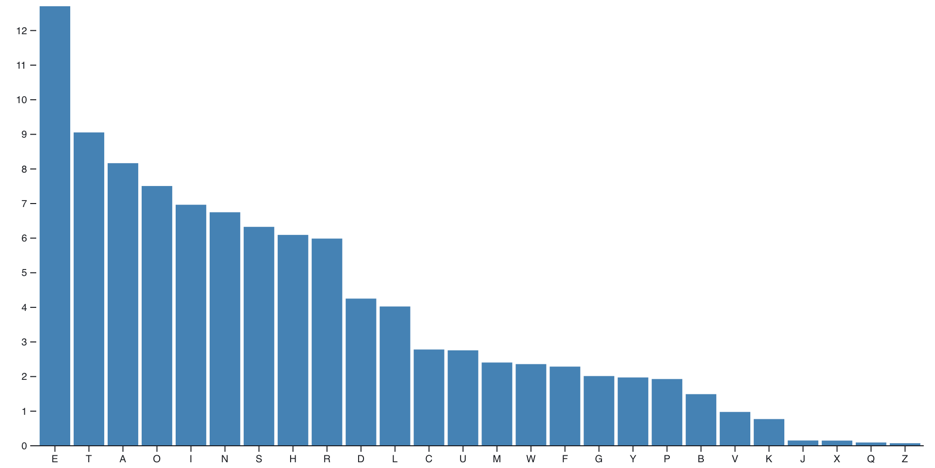

+++
title = "vega, d3, echart 3个绘图工具对比"
description = "vega, d3, echart 3个绘图工具对比"
date = 2025-08-14
draft = false
template = "blog/page.html"

[extra]
toc = true
+++

# Compare by Case



## [D3 bar-chart](https://observablehq.com/@d3/bar-chart/2#chart)
```javascript
chart = {
  // Declare the chart dimensions and margins.
  const width = 928;
  const height = 500;
  const marginTop = 30;
  const marginRight = 0;
  const marginBottom = 30;
  const marginLeft = 40;

  // Declare the x (horizontal position) scale.
  const x = d3.scaleBand()
      .domain(d3.groupSort(data, ([d]) => -d.frequency, (d) => d.letter)) // descending frequency
      .range([marginLeft, width - marginRight])
      .padding(0.1);
  
  // Declare the y (vertical position) scale.
  const y = d3.scaleLinear()
      .domain([0, d3.max(data, (d) => d.frequency)])
      .range([height - marginBottom, marginTop]);

  // Create the SVG container.
  const svg = d3.create("svg")
      .attr("width", width)
      .attr("height", height)
      .attr("viewBox", [0, 0, width, height])
      .attr("style", "max-width: 100%; height: auto;");

  // Add a rect for each bar.
  svg.append("g")
      .attr("fill", "steelblue")
    .selectAll()
    .data(data)
    .join("rect")
      .attr("x", (d) => x(d.letter))
      .attr("y", (d) => y(d.frequency))
      .attr("height", (d) => y(0) - y(d.frequency))
      .attr("width", x.bandwidth());

  // Add the x-axis and label.
  svg.append("g")
      .attr("transform", `translate(0,${height - marginBottom})`)
      .call(d3.axisBottom(x).tickSizeOuter(0));

  // Add the y-axis and label, and remove the domain line.
  svg.append("g")
      .attr("transform", `translate(${marginLeft},0)`)
      .call(d3.axisLeft(y).tickFormat((y) => (y * 100).toFixed()))
      .call(g => g.select(".domain").remove())
      .call(g => g.append("text")
          .attr("x", -marginLeft)
          .attr("y", 10)
          .attr("fill", "currentColor")
          .attr("text-anchor", "start")
          .text("↑ Frequency (%)"));

  // Return the SVG element.
  return svg.node();
}
```

## [D3 Observable Plot API](https://observablehq.com/@d3/bar-chart/2#cell-546)
```javascript
Plot.plot({
  y: {percent: true},
  marks: [
    Plot.barY(data, {x: "letter", y: "frequency", fill: "steelblue", sort: {x: "-y"}}),
    Plot.ruleY([0])
  ]
})
```

## [Vega bar](https://vega.github.io/vega/examples/bar-chart/)
```json
{
  "$schema": "https://vega.github.io/schema/vega/v6.json",
  "description": "A basic bar chart example, with value labels shown upon pointer hover.",
  "width": 400,
  "height": 200,
  "padding": 5,

  "data": [
    {
      "name": "table",
      "values": [
        {"category": "A", "amount": 28},
        {"category": "B", "amount": 55},
        {"category": "C", "amount": 43},
        {"category": "D", "amount": 91},
        {"category": "E", "amount": 81},
        {"category": "F", "amount": 53},
        {"category": "G", "amount": 19},
        {"category": "H", "amount": 87}
      ]
    }
  ],

  "signals": [
    {
      "name": "tooltip",
      "value": {},
      "on": [
        {"events": "rect:pointerover", "update": "datum"},
        {"events": "rect:pointerout",  "update": "{}"}
      ]
    }
  ],

  "scales": [
    {
      "name": "xscale",
      "type": "band",
      "domain": {"data": "table", "field": "category"},
      "range": "width",
      "padding": 0.05,
      "round": true
    },
    {
      "name": "yscale",
      "domain": {"data": "table", "field": "amount"},
      "nice": true,
      "range": "height"
    }
  ],

  "axes": [
    { "orient": "bottom", "scale": "xscale" },
    { "orient": "left", "scale": "yscale" }
  ],

  "marks": [
    {
      "type": "rect",
      "from": {"data":"table"},
      "encode": {
        "enter": {
          "x": {"scale": "xscale", "field": "category"},
          "width": {"scale": "xscale", "band": 1},
          "y": {"scale": "yscale", "field": "amount"},
          "y2": {"scale": "yscale", "value": 0}
        },
        "update": {
          "fill": {"value": "steelblue"}
        },
        "hover": {
          "fill": {"value": "red"}
        }
      }
    },
    {
      "type": "text",
      "encode": {
        "enter": {
          "align": {"value": "center"},
          "baseline": {"value": "bottom"},
          "fill": {"value": "#333"}
        },
        "update": {
          "x": {"scale": "xscale", "signal": "tooltip.category", "band": 0.5},
          "y": {"scale": "yscale", "signal": "tooltip.amount", "offset": -2},
          "text": {"signal": "tooltip.amount"},
          "fillOpacity": [
            {"test": "datum === tooltip", "value": 0},
            {"value": 1}
          ]
        }
      }
    }
  ]
}
```

## [Vega Lite](https://vega.github.io/vega-lite/examples/bar.html)
```json
{
  "$schema": "https://vega.github.io/schema/vega-lite/v6.json",
  "description": "A simple bar chart with embedded data.",
  "data": {
    "values": [
      {"a": "A", "b": 28}, {"a": "B", "b": 55}, {"a": "C", "b": 43},
      {"a": "D", "b": 91}, {"a": "E", "b": 81}, {"a": "F", "b": 53},
      {"a": "G", "b": 19}, {"a": "H", "b": 87}, {"a": "I", "b": 52}
    ]
  },
  "mark": "bar",
  "encoding": {
    "x": {"field": "a", "type": "nominal", "axis": {"labelAngle": 0}},
    "y": {"field": "b", "type": "quantitative"}
  }
}
```

## EChat
```javascript
option = {
  xAxis: {
    type: 'category',
    data: ['Mon', 'Tue', 'Wed', 'Thu', 'Fri', 'Sat', 'Sun']
  },
  yAxis: {
    type: 'value'
  },
  series: [
    {
      data: [120, 200, 150, 80, 70, 110, 130],
      type: 'bar'
    }
  ]
}
```