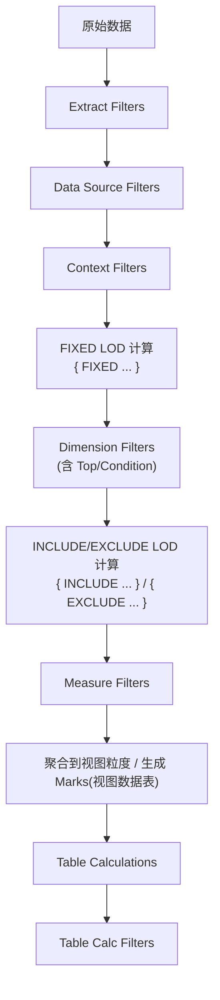
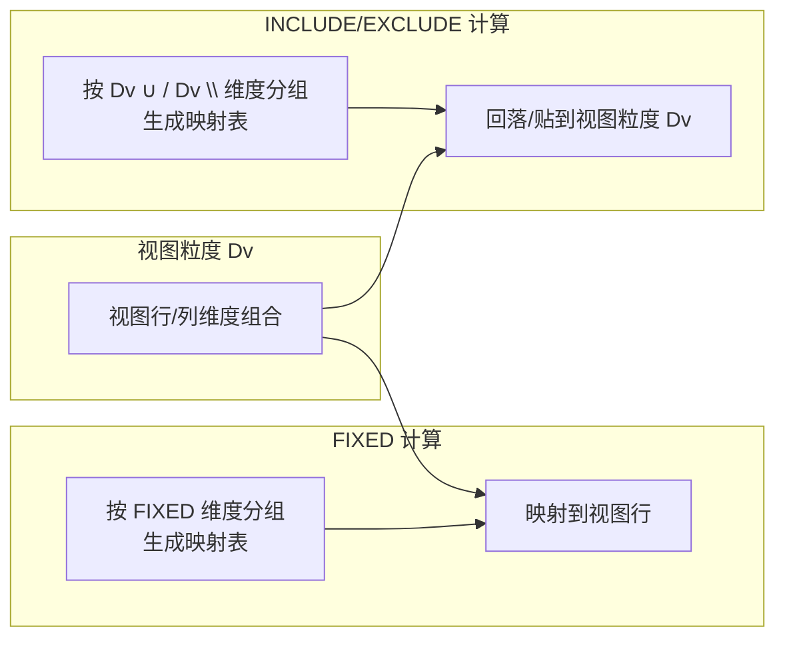

+++
title = "Tableau 计算图"
description = "本文是对 agent 相关技术的一个汇编"
data = "2026-01-30"
dfaft = false
template = "blog/page.html"

[extra]
toc = true
+++

```mermaid
flowchart TB
    A[原始数据] --> B[Extract Filters]
    B --> C[Data Source Filters]
    C --> D[Context Filters]
    D --> E["FIXED LOD 计算<br/> { FIXED ... }"]
    E --> F["Dimension Filters<br/>(含 Top/Condition)"]
    F --> G["INCLUDE/EXCLUDE LOD 计算<br/>{ INCLUDE ... } / { EXCLUDE ... }"]
    G --> H[Measure Filters]
    H --> I["聚合到视图粒度 / 生成 Marks(视图数据表)"]
    I --> J[Table Calculations]
    J --> K[Table Calc Filters]
```

```mermaid
flowchart LR
    subgraph View[视图粒度 Dv]
      V[视图行/列维度组合]
    end

    subgraph Fixed[FIXED 计算]
      F1[按 FIXED 维度分组<br/>生成映射表]
      F2[映射到视图行]
      F1 --> F2
    end

    subgraph IncExc[INCLUDE/EXCLUDE 计算]
      I1[按 Dv ∪ / Dv \\ 维度分组<br/>生成映射表]
      I2[回落/贴到视图粒度 Dv]
      I1 --> I2
    end

    V --> F2
    V --> I2
```