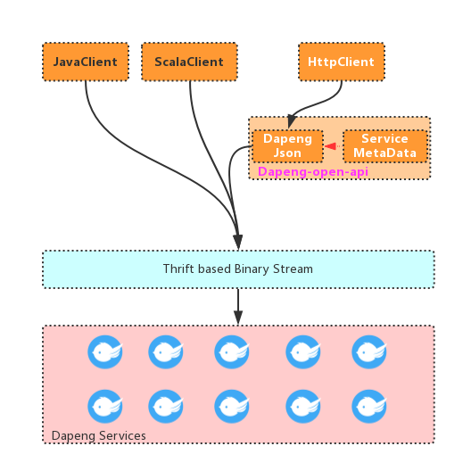
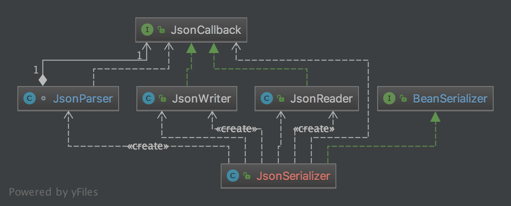
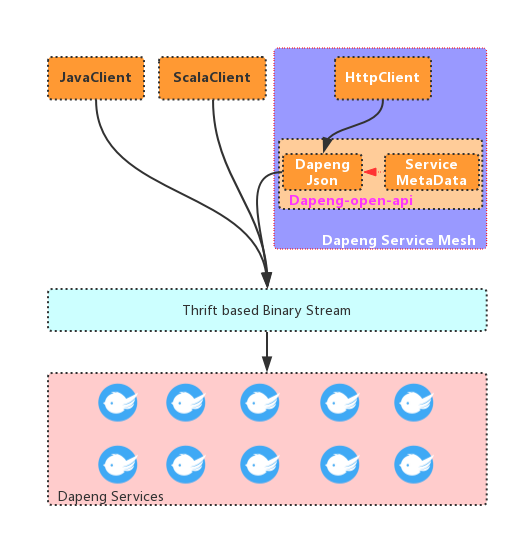

+++
title = "dapeng JSON 流式处理简介"
description = "dapeng支持使用JSON作为RPC的内容编码协议，且提供了独特的流式处理API，可以以极高的效率处理JSON通讯，本文介绍这个API的设计思路。"
date = 2020-09-04T12:00:00+00:00
draft = false
template = "blog/page.html"

[taxonomies]
authors = ["wangzx"]
+++

# 背景
dapeng的原生协议是thrift, 包括二进制、压缩二进制两种模式. 原生协议的优势是有丰富的数据类型支持能力（优于JSON）, 传输格式紧凑（远比JSON更小, 
尤其是压缩二进制格式）, 序列化开销小（几乎没有解析成本和数据转换成本）, 这些优点是dapeng选择thrift的基本原因.

虽然有很多的优势, 原生的thrift协议最大的缺点就是对"人"不友好, 而JSON则是human readable的最优选择, 目前已是互联网应用的事实标准. 
它相比XML更为简洁, 当然也更为紧凑, 便于开发者阅读, 非常方便在WEB上应用. 这使得它取代xml成为了数据交换事实上的行业标准. 尽管语言之争是个永恒的话题, 
但在数据交换格式上, JSON是毫无争议的王者.

如何为dapeng服务提供对JSON的支持, 可以使用restful的形式来调用dapeng服务, 从而方便WEB前端、PHP或者命令行工具来调用服务呢？
dapeng提供了API Gateway, 将JSON请求转换成为thrift请求, 对外提供了一个restful + JSON的API接入服务. 
API Gateway包括了鉴权、流控、路由等多个功能, 但其核心的功能是完成JSON到thrift的双向数据转换工作, 本文介绍了dapeng-json的设计特色, 
包括dapeng是如何高效率的完成数据转化、如何处理可变压缩二进制格式等挑战的.

> dapeng-json 在技术上的一个最大的特点是：采用流式处理的方式，无论是对请求和返回信息，都无需构建完整的 JSON 对象，从而大大减少内存的分配和GC的
开销，即使对于巨大的请求/返回，也可以在很少的内存消耗下完成转换，因对，对于网关一类的应用来说，可以带来巨大的性能提升，使用普通的 4core 4G 的
虚拟机就可以达到 20K+/s 的 QPS，这是非流式处理的方式很难达到的。

# dapeng-json的设计目标
dapeng-json的最终目的就是实现JSON字符串与基于thrift协议格式的二进制流之间的高效互换.具体有如下三个指标:

- 高性能
  考虑到 dapeng-json 作为 http 网关甚至后续 service-mesh 的核心模块, 要求其能实现高效的序列化以及反序列化, 以支持海量请求的处理. 如果序列化的开销高, 则势必会降低网关的接入能力.
  >toBeDone, 性能参数(JSON跟普通java客户端的性能对比)
- 低内存使用
  虽然大部分情况下的JSON请求、返回都是数据量较小的场景, 但作为平台框架, 也需要应对更大的JSON请求和返回, 比如1M、甚至10M. 在这些场景下, 如果需要占用大量的内存, 那么势必导致巨大的内存需求, 同时引发频繁的GC操作, 也会联动影响到整个网关的性能.
  dapeng-json参考了XML SAX API的设计思想, 创造性的引入了JSON Stream API, 采用流式的处理模式, 实现JSON 对 thrift 的双向转换, 无论数据包有多大, 都可以在一定固定的内存规模内完成.
- 容错性好
  在dapeng中, IDL层面定义了基本的服务调用前置条件, 譬如必须使用正确的数据类型, 有的字段是必填的. 在使用json-thrift转换时, 
  必须能够正确的进行数据转换, 不要把错误的请求传递给服务方. 并且需要在有错误的情况下, 清晰的反馈错误, 以便开发者进行定位.

在介绍dapeng-JSON的设计思路之前, 我们先看看dapeng对JSON的支持架构:


> 右上角的两个模块(dapeng-json, ServiceMetaData), 再暴露一个http端口, 可以构成一个典型的 HttpServiceAgent.

# dapeng-json 的实现思路
让我们重温一下dapeng-json的使命:
> dapeng-json的最终目的就是实现 JSON 字符串与 thrif 格式的二进制流之间的高效互换

## 常规方式：string -> JSONObject -> POJO -> Binary
1. 将JSON 字符串转换为 JSON 对象模型（JSONObject）
2. 然后通过三方JSON-POJO映射框架（如Google的Gson, 阿里的FastJSON等), 将JSONObject转换成为POJO,
3. 通过dapeng生成的POJO序列化代码完成从POJO到thrfit的转换过程.

部分框架可以结合1和2, 直接从JSON字符串转换成为 POJO.

不过, 这个设计不满足我们的设计要求：
- 这个过程经过了三次转换, 会产生大量的临时对象, 有很大的内存要求
- 使用反射方式对于旨在榨干服务器性能以获取高吞吐量的系统来说, 难以达到性能最佳
- 这个方案有很强的“类型”需求, 在 API 网关中必须依赖 POJO 包, 要求JSON模块依赖服务的api包（否则没法知晓服务接口的输入输出参数）, 这个依赖会降低API网关的动态能力, 使得部署维护复杂.

## 基于流的转换：JSON bytes -> Binary
这是dapeng-json所采用的方式, 显而易见, 这个过程只经历了一次协议转换, 即直接将从网络上接收到的一个JSON字节流直接转换成为thrift数据包.



### JSONCallback
从上节我们可以得知, JSON的组成元素类型不多, 且每种元素都有自己的开始/结束字符, 我们暂且称这些字符为关键字符.

为了高效的处理JSON字符串, 我们采用了Streaming的处理方式:逐个字符读入JSON字符串,碰到关键字符就触发一定的处理动作. 为此, 我们首先创建一个接口JSONCallback, 并定义了一组回调方法用以处理每种JSON元素:
```Java
package com.github.dapeng.json;

import com.github.dapeng.org.apache.thrift.TException;

/**
 * @author zxwang
 */
public interface JSONCallback {

    /**
     * Called at start of JSON object, typical handle the '{'
     *
     * @throws TException
     */
    void onStartObject() throws TException;

    /**
     * Called at end of JSON object, typical handle the '}'
     *
     * @throws TException
     */
    void onEndObject() throws TException;

    /**
     * Called at start of JSON array, typical handle the '['
     *
     * @throws TException
     */
    void onStartArray() throws TException;

    /**
     * Called at end of JSON array, typical handle the ']'
     *
     * @throws TException
     */
    void onEndArray() throws TException;

    /**
     * Called at start of JSON field, such as: "orderId":130
     *
     * @param name name of the filed, as for the example above, that is "orderId"
     * @throws TException
     */
    void onStartField(String name) throws TException;

    /**
     * Called at end of JSON field
     *
     * @throws TException
     */
    void onEndField() throws TException;

    /**
     * Called when a boolean value is met,
     * as to given field: <pre>"expired":false</pre>
     * First onStartField("expired") is called, followed by a call onBoolean(false) and a call onEndField()
     *
     * @param value
     * @throws TException
     */
    void onBoolean(boolean value) throws TException;

    /**
     * Called when a double value is met.
     *
     * @param value
     * @throws TException
     */
    void onNumber(double value) throws TException;

    /**
     * Called when a long/int value is met.
     *
     * @param value
     * @throws TException
     */
    void onNumber(long value) throws TException;

    /**
     * Called when a null value is met.
     * Such as: "subItemId":null
     *
     * @throws TException
     */
    void onNull() throws TException;

    /**
     * Called when a String value is met.
     * Such as: "name": "Walt"
     *
     * @param value
     * @throws TException
     */
    void onString(String value) throws TException;
}
```
> 这个接口的设计借鉴了XML SAX的设计思想, 既可用于序列化（生成JSON）, 也可以反序列化（解析JSON字符串）.

此外, dapeng核心包里定义了一个通用的编解码接口:
```
package com.github.dapeng.core;

import com.github.dapeng.org.apache.thrift.TException;
import com.github.dapeng.org.apache.thrift.protocol.TProtocol;

/**
 * 通用编解码器接口
 * @author ever
 * @date 2017/7/17
 */
public interface BeanSerializer<T> {

    /**
     * 反序列化方法, 从thrift协议格式中转换回PoJo
     * @param iproto
     * @return
     * @throws TException
     */
    T read(TProtocol iproto) throws TException;

    /**
     * 序列化方法, 把PoJo转换为thrift协议格式
     * @param bean
     * @param oproto
     * @throws TException
     */
    void write(T bean, TProtocol oproto) throws TException;

    /**
     * PoJo校验方法
     * @param bean
     * @throws TException
     */
    void validate(T bean) throws TException;

    /**
     * 输出对人友好的信息
     * @param bean
     * @return
     */
    String toString(T bean);
}

```
dapeng-JSON通过JSONSerializer实现了这个编解码器.

在深入具体实现之前, 我们先了解一下dapeng的服务元信息, 因为服务元信息是dapeng很多模块的关键.

### dapeng 元信息
前文提到, dapeng服务有丰富的元信息, 非常类似于Java Class的反射信息, 通过反射, 我们动态的访问一个对象的各个字段、方法, 而无需依赖于编译时期的类型信息. 同样, 有了服务元信息, 我们也可以在运行期访问到IDL中定义的所有信息.
>可以通过元数据信息自动生成java/scala等客户端代码.

>可以通过元数据信息在客户端序列化/反序列接口参数或者返回信息的时候, 校验每一个字段是否有效.

这里是一个服务元信息的示例：
``` xml
<request name="getAddress_args">
    <fields>
        <field tag="1" name="request" optional="false" privacy="false">
            <dataType>
                <kind>STRUCT</kind>
                <ref>com.today.api.dictionary.request.GetAddressRequest</ref>
            </dataType>
            <doc> 查询请求</doc>
        </field>
    </fields>
</request>
<struct namespace="com.today.api.dictionary.request" name="GetAddressRequest">
    <doc>新增/编辑 字典 的请求实体</doc>
    <fields>
        <field tag="1" name="provinceCode" optional="true" privacy="false">
            <dataType>
                <kind>STRING</kind>
            </dataType>
            <doc>省级地址编码</doc>
        </field>
        <field tag="2" name="cityCode" optional="true" privacy="false">
            <dataType>
                <kind>STRING</kind>
            </dataType>
            <doc>市级地址编码</doc>
        </field>
        <field tag="3" name="districtCode" optional="true" privacy="false">
            <dataType>
                <kind>STRING</kind>
            </dataType>
            <doc>区级地址编码</doc>
        </field>
        <field tag="4" name="townCode" optional="true" privacy="false">
            <dataType>
                <kind>STRING</kind>
            </dataType>
            <doc>乡镇级地址编码</doc>
        </field>
        <field tag="5" name="streetCode" optional="true" privacy="false">
            <dataType>
                <kind>STRING</kind>
            </dataType>
            <doc>街道级地址编码</doc>
        </field>
    </fields>
</struct>
```


### JSONSerializer.write： 序列化(JSONString->Binarry)：自顶向下解析JSON
```java
@Override
public void write(String input, TProtocol oproto) throws TException {
    JsonReader jsonReader = new JsonReader(service, method, version, struct, requestByteBuf, oproto);
    new JsonParser(input, jsonReader).parseJsValue();
}
```
我们通过JsonParser实现对JSON字符串的解析, 在流式解析JSON的过程中, 我们会产生JsonCallback事件, JsonReader就是负责将相应的事件转化为Thrift的操作.

考虑之前提到的JSON例子:
```json
{
    "createOrderRequest": {
        "memberId": 1024,
        "payCode": "tidf3325aaeny",
        "storeIds: [28, 35, 64],
        "items": [
           {
               "skuId": 24,
               "amount": 4.5
           }, {
               "skuId": 106,
               "amount": 20.0
           }
        ]
    }
}
```

对应的 JSONCallback 序列如下:
```
- onStartObject
    - onStartFiled createOrderRequest
        - onStartObject
            - onStartField memberId
                - onNumber 1024
            - onEndField
            - onStartField payCode
                - onString tidf3325aaeny
            - onEndField 
            - onStartField storeIds
                - onStartArray
                    - onNumber 28
                    - onNumber 35
                    - onNumber 64
                - onEndArray
            - onEndField
            - onStartField items
                - onStartArray
                    - onStartObject
                        - onStartField skuId
                            - onNumber 24
                        - onEndField
                        - onStartField amount
                            - onNumber 4.5
                        - onEndField
                    - onEndObject
                    - onStartObject
                        - onStartField skuId
                            - onNumber 106
                        - onEndField
                        - onStartField amount
                            - onNumber 20.0
                        - onEndField
                    - onEndObject
                - onEndArray
            - onEndField          
        - onEndObject
    - onEndField
- onEndObject
```

### JSONSerializer.read：反序列化(Binary->JSONString)
这个过程是write的一个逆向过程.

针对JSON的各种数据类型
通过dapeng强大的服务元数据,我们可以知道某个服务的某个方法的某个入参的元数据信息,例如有多少field,每个field的类型,是否必填等:

在处理JSON的过程中, 我们可以通过元数据来实现如下功能:
>1. 对于接口请求参数中没有的字段, 可直接忽略
>2. 对每个字段做必要的类型校验, 同时
>3. 对于接口请求参数中要求必填的参数字段,在处理完整个JSON字符串之后,做一个对必填字段的校验. 如果存在必填字段缺失的情况,那么直接返回提示给调用方,防止无效请求发到服务端.

基于string-stream的流式处理机制,尽可能少的分配内存以及创建字符串,支持fast-failed. 流式处理不需要在内存中构建好整个JSON对象再做处理, 它对内存的消耗取决于JSON结构的深度而不是长度. 例如某个JSON结构体包含一个数组元素, 那么流式处理机制所需要的最大内存等于单个数组元素的大小, 而数组的长度对于内存消耗来说没有影响. 这个特性很重要, 就算要处理几MB或者几十MB甚至几百MB的JSON数据, dapeng-JSON可能也只是需要几KB的内存消耗而已.



# others
## Number类型的数据转换

由于JavaScript规范中， 数字只有一种类型:Number，且是浮点类型。那么对于一个大的长整型(Long, 超出[-2^53, 2^53]范围，也即[-9007199254740992,9007199254740992])，使用Number类型会存在不可预料的结果。例如:
```
> var l1 = 9007199254740995
> var l2 = 9007199254740996
> l1 == l2
true
```
针对Json数值类型在转换过程中存在精度丢失的问题， 约定如下：
### 1. 建议
1. 首先我们不建议在业务接口中使用Double类型的字段， 尽量用BigDecimal。
2. 如果某个字段是个长整型(Long)，且预期不在[-2^53, 2^53]范围内，也即[-9007199254740992,9007199254740992],  那么建议前端封装json数据的时候， 该字段用字符串（dapeng-json转换引擎会通过服务元数据准确的把该字符串转回Long）

### 2. 服务端返回给前端的数据(thrift->json)
对于Long类型，会判断一下大小，如果超出[-2^53, 2^53]， 那么我们会把Long类型转换成字符串。 否则就直接输出Number类型

对于Double类型， 这个就直接输出Number类型了。

### 3. 前端到后端的数据传递(json->thrift)
对于Long类型， 不管json是Number还是字符串， 我们都转成标准的Long

对于Double类型，不管json是Number还是字符串， 我们都转成标准的Double