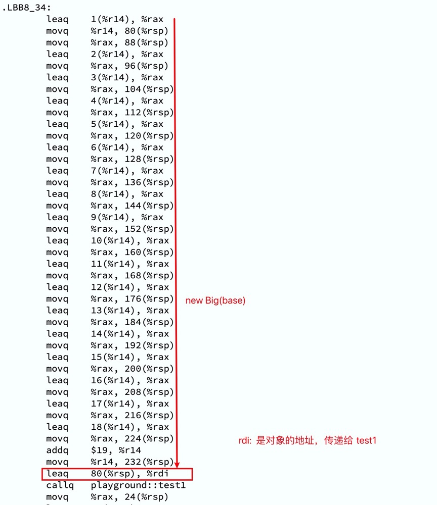

+++
title = "Rust vs C++: A Performance Comparison"
description = "1"
date = 2024-08-15T09:19:42+00:00
draft = false
template = "blog/page.html"

[taxonomies]
authors = ["Rust"]

+++

本文内容节选自：
- [Rust vs C++: A Performance Comparison. Part 1](https://medium.com/rustaceans/c-vs-rust-a-performance-comparison-46d1a669beb1)
- [Rust vs C++. A Performance Comparison. Part 2](https://medium.com/rustaceans/rust-vs-c-a-performance-comparison-part-2-646ceeb1fbd4)
- [Rust vs C++. A Performance Comparison. Part 3. Effective abstractions](https://medium.com/rustaceans/rust-vs-c-a-performance-comparison-part-3-effective-abstractions-e740e8262ce8)

1. Aliasing 数据别名
    - Reference 不同于 raw pointer：总是有效的指针（除了 danglin ），对齐。
    - &T 确保数据不可变，可以进行寄存器存储等激进的优化措施。这在C++中并不可行。
    - &mut T 可以确保独占，在本文中的案列中，mul_by_2 的 src 和 dest 可以确保不会引用同一个区域
      （两个slice无数据重叠），因而在生成的代码中，可以进行如下的优化：使用 movdqu 等指令一次移动 16 字节内容（相当于2个u64)。
    - 如果是 *const T 指针，则不会保证引用同一个区域，需要先进行检测，才能使用 movdqu 等指令进行移动处理。
    
    验证代码 [playgroud 链接](https://play.rust-lang.org/?version=stable&mode=release&edition=2021&gist=412780e50ae0ab4c8c62bf8869808897)，
    可以查看其生成的ASM代码的差异

2. Move 语义
   C++ 的 std::move 模拟了一个 move 语义，但又不能象 Rust 一样的保证原始变量不能再被访问。我对 C++ 11引入的这些概念
   并不熟悉，只是感觉 std::move 和 std::forward 相比 rust 来说，要复杂很多。

   通过 move 语义，编译期可以进行更多的优化，比如在函数调用时，可以选择不再复制数据，而是直传递用数据的指针，这样可以避免数据的复制。
   验证代码：[move playground](https://play.rust-lang.org/?version=stable&mode=release&edition=2021&gist=19b61fbf97f1734cdb6b52801b2ab03c)
   - 由于 rust 做了太多的优化，如果结构体较小的话，就直接通过寄存器传递参数了，反而可能不走地址传递的优化。
     

3. Dynamic dispatch
   C++ 的 VTBL 开销对 virtual 函数来说是必不可少的，及每个对象都会携带一个 VTBL 指针，除了占用内存的
   开销之外，VTBL调用也会是2次访问，同时也阻碍了 inline 的优化。
   而 Rust 的 Trait 可以通过 Generic 来实现完全静态的多态，除了会增加代码体积之外，无而外开销。
   也可以通过&dyn 方式实现动态的多态。算是一个不错的平衡。

4. Struct Layout and Padding.
    - C++ 的 struct 的内存布局与字段的定义顺序有关，可能会消耗更多的内存。而 Rust 默认则最优化内存布局，
      从而减少内存占用。
    - Rust 的 enum 类型很难在C++中表达
    - 诸如 Option<T> 这样的类型对 &T 来说是零开销的，即根本不存在 tag 的开销。这也是一个很神奇的设计，
    - 兼顾简洁和性能，堪称 Zero Cost Abstract 的典范。再看看 Scala 的 Option 瞬间就不香了。
    - 在 Rust 中很广泛的使用 struct 嵌套的方式来定义新的数据类型，包括 Rc, RefCell 等，而在 Scala 中为了
      到达类似的zero cost效果，可以通过 opaque type 来实现，但是这样的代码会更加复杂，还是 Rust 的设计更加优雅。

5. Compile-time computations.
   应该说 comptime 方面，Rust 通过 const, constexp 关键字提供了简单，但并不够强大的支持。
   在这方面，C++、Zig、Scala语言都走得更远。不过，Rust 中，我们可以通过 Macro 来实现相似的功能。
   或许，在 comptime 这一块，最优特色的应该是 zig 语言了。
   当然 Scala 的 Macro 也是非常完备的，不过复杂性也有些令人生畏了。