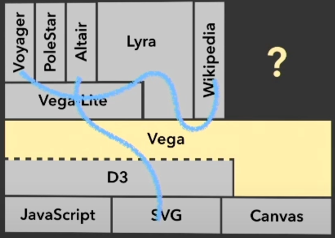

+++
title = "September 2024"
date = 2024-09-01
draft = false
template = "blog/page.html"

[taxonomies]
authors = ["monthly"]

+++

# Languages
- [Tree-Structured-Concurrency](https://blog.yoshuawuyts.com/tree-structured-concurrency/)
  
   在很多编程语言中，对多线程和并发处理，都停留在线程池、锁、消息队列等机制上。Structured Concurrency 在实际业务中，是一个
   更为贴合的并发模型。Java 在 19-23 版本中，也提出了一个 Preview 版本的 Structured-Concurrency（我在公司内部项目中，
   也参考这个概念，设计了一个Scala 的 Structured Concurrency API）。
   {{ resize_image(path="@/monthly/2024-09/structured-concurrency.png", width=400, height=400, op="fit_width") }}

   > 这个作者的一系列文章，都是围绕着Rust 语言中的概念，例如：Self-Reference, Pin， Async/Await etc. 值得持续关注学习。
- [Rust GUI](https://dioxuslabs.com)
  按照文档，跑了一个 Web 示例程序。 感觉：
  1. API 很熟悉。 rsx! 相当与将 JSX 和 react 风格迁移到 Rust 中。
  2. 一种开发模式，可以支持 WEB, Desktop, TUI, 确实很有吸引力。到了 WEB 中也运行的是 Rust（基于WASM） 而非 JavaScript。
  3. dx 风格也和 cargo/npm 风格很相似，开发模式下，修改源代码自动编译、热加载。简单的例子体验不错，不知道在复杂的项目中，这个效率会如何？
     现在来看，是有些担心的，一是 rust 编译速度，二是整个 wasm 重新加载，hot reload 相当于是整个应用了。
  4. wasm 的编译大小，目前看一个简单的例子（dx new 的示例代码)，编译后大小为 957K, br压缩后为 240K。 更复杂的项目会有多大呢？

# MPP & OLAP
- [GlareDB](https://glaredb.com) 又一个跨库执行SQL的引擎，从目前官网上没有看到与性能相关的信息，不知道这方面的表现如何。
- [Databricks 收购了 Apache Iceberg背后公司 Tabular](https://www.sohu.com/a/783829162_121124375)
  - [iceberg](https://iceberg.apache.org) 开放的分析型表存储格式：支持
    1. schema evolution
    2. 隐藏分区
    3. 分区结构演进
  - [snowflake](https://www.snowflake.com) 云数据仓库，支持
- [DuckDB internals](https://www.youtube.com/watch?v=bZOvAKGkzpQ)
  1. in process like sqlite.
  2. 1.1.0 性能优化
     - 版本增加了对 join 的优化，可以根据右表的过滤结果，来优化左表的筛选。
     - 对 CTE 的 material 的优化。
  3. extension 支持 rust开发

  > 考虑 DuckDB 作为数据分析的基础引擎，以解决复杂分析场景下的性能问题，与数据库兼容性问题。不同的源数据库，其提供的查询能力差别较大，
  > （语法，函数）等，对 Full JOIN能力、窗口函数的计算能力等， 逐一适配成本太大，考虑使用 DuckDB 作为数据分析引擎，可以解决这个问题。

- [Pipelined Relational Query Language](https://github.com/prql/prql) 一个更为结构化的SQL描述
  
  在数据分析时，对复杂的SQL进行理解，往往是非常头痛的，使用 with CTE 可以让这个过程便得更为结构化， PRQL 提供了另外一个参考的视角。
- [Hex](https://hex.tech) 一个蛮有特色的数据分析产品，可以体验一下其产品设计。
  1. Notebook 风格，一个 notebook 就是一个 workspace，支持 Python, SQL两种分析语言。
  2. 这些计算目前来看是执行在 server 上的
- [Rill Opensource](Dashboards that move as fast as your business)
  体验了一下，作为 EndUser，功能还比较粗燥。

# Web & Visualization
- NoBuild
  - [You can't get faster than No Build](https://world.hey.com/dhh/you-can-t-get-faster-than-no-build-7a44131c) 
  - [#NoBuild on X.com](https://x.com/dhh/status/1769903387527790975) 
  - [Modern web apps without JavaScript bundling or transpiling](https://world.hey.com/dhh/modern-web-apps-without-javascript-bundling-or-transpiling-a20f2755) 

  #nobuild 对 Web 的众多 pack 框架总是很不爽，mark 一下。

  之前也测试过一个网站，https://shoelace.style/components/badge 由于采用了 HTTP/2，在不pack的情况下，也能快速访问。
  DHH 是 NoBuild 的发起人，也是 Webpacker(非webpack) 的创建者。（不过，如果使用 ts，还是需要一个 transpiling）
  1. 减少了 build 时间
  2. 由于不再bundle，对单个module的修改，无需重新build整个项目，以及重新下载整个大的bundle文件。
  3. 由于不再bundle，对多页面应用，可以更好的利用浏览器的缓存机制。（不同页面 bundle 会导致重复的下载）

- [Signals behind the scenes](https://levelup.gitconnected.com/signals-behind-the-scenes-19cbcb6b802b) 介绍了响应式款架 中
  Signal API 的实现原理。
  - Variable Manager: 是我设计的一个更为宏观层面（响应联路更长、且支持异步处理）的前端变量响应式管理器，目前在内部产品中使用，后续整理成技术文章。
- [Wasm: 2023年报告](https://medium.com/ekino-france/webassembly-the-future-of-backend-development-b40bdc7c5cb4)
  - 作为 Plugin 使用。 例如 nginx plugin。相比 LUA 来说，可以提供更好的性能、完成更复杂的功能，以及使用开发者更熟悉的编程语言。
  - 目前，我觉得最为缺失的，是缺少 Debugger 支持。
  
- Vega-altair: Declarative Visualization in Python 一个 Python 的可视化库，支持声明式的可视化设计。
   - [Vega-Lite](https://vega.github.io/vega-lite/) 基于 Vega，更偏向于用户层, 数据描述式风格
   - [Vega](https://vega.github.io/vega/) 一个更底层的图表描述语言，更归一化，命令式风格
   - [vega on observablehq](https://observablehq.com/@vega)
   - [How vega works](https://observablehq.com/@vega/how-vega-works): 一篇介绍 vega 的内部workflow的文章，pipeline(data flow) + react 是其核心。
   - [Vega and D3](https://vega.github.io/vega/about/vega-and-d3/) d3相比vega更为low level
   - [技术人员眼中的BI之可视化 —— 标准家：Vega & Vega-Lite](https://zhuanlan.zhihu.com/p/234762889)
     > 当使用Vega-Lite和Voyager时，总有种”小tableau“的感觉，和tableau神似。这也引出了是不是有了Vega-Lite和Voyager，
     > 我们其实就具备了一个小型的BI。
     > Vega 与 Tableau 有相近的渊源。 

     > 不知道 vega 的性能表现如何？可以评估使用 wasm 或者 webgl/webgpu 来进行加速？
     
   - 在 https://vega.github.io/vega/about/vega-and-d3/ 文中提到了 canvas 性能与 SVG 的对比：
     > 通过引入一个中间层 scenegraph, Vega 可以渲染为 canvas 或者 SVG， 在完整刷新时，Canvas 可以提供2-10倍的速度提升
     > 而 SVG 则更适合于无限放大，可打印能力。Vega 可以扩展到使用 WebGL 来进行渲染（不过，https://github.com/vega/vega-webgl-renderer
     > 这个项目似乎已经8年没有维护了，其Demo在现有的浏览器中都无法正确运行）。
   
   
   - [Observable Framework](https://github.com/observablehq/framework) JS/TS 的 notebook.
- [Build Reactive Web Components with SSR](https://dev.to/aralroca/build-reactive-web-components-with-ssr-3pb9?utm_source=dormosheio&utm_campaign=dormosheio)
  - https://brisa.build 这个 framework 还没有open source, 从 doc 来看，提供的 API 尤其是 CLI API 比较友好。 Lit项目的 SSR 感觉还不是很简单。
  
# Tools

# Books
- 本月入手 rust-under-the-hood 从生成的汇编代码来理解 Rust 语言。

  {{ resize_image(path="@/monthly/2024-09/rust-under-the-hood.png", width=200, height=400, op="fit_width") }}
  
  之前也断续阅读过一些 Rust 编译生成的汇编代码，确实，从更低成本的角度来理解语言特性和概念，往往会带来更为深刻的理解。更何况
  Rust 自身也是面向底层的一门语言，各种特性的设计都与内存、CPU 优化密切关联。很多在上层复杂的概念，往往只是在上层中不同
  角度的投影，在底层反而简单明了。