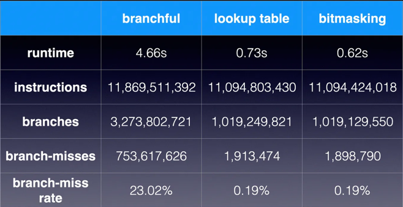

+++
title = "January 2025"
description = "2025-01 monthly digest"
date = 2025-01-01
draft = false
template = "blog/page.html"
+++

# Languages
1. [Performance optimization — branchless programming](https://medium.com/@techhara/performance-optimization-technique-branchless-programming-a40c0a35511e)
   ```cpp
   int branchful(std::optional<int> x, std::optional<int> y) {
    const int NULL_VALUE = -1;

    if (x.has_value() && y.has_value()) {
        return *x * *y;
    } else {
        return NULL_VALUE;
    }
   }
   ```
   消除分支：
   ```cpp
   boolean hasX = x.has_value();
   boolean hasY = y.has_value();
   boolean all = hasX && hasY;
   return all ? *x * *y : NULL_VALUE;
   ```
   6-7倍性能提升。 在 CPU 层，cmov 指令可以实现分支消除，
   
   工具： perf stat -e instructions,branches,branch-misses  command args
   
2. [Performance optimization—efficient cache programming 1](https://medium.com/@techhara/performance-optimization-efficient-cache-programming-f107dce3bef0)
   1. 减少 struct 的大小，对大数组类的数据结构，可以减少内存的占用，从而提高 cache 的命中率。
3. [How to write code to make the cpu execute faster](https://blog.devgenius.io/cpu-cache-how-to-write-code-to-make-the-cpu-execute-faster-cc0cf4969c4b)
   - Linux: `/sys/devices/system/cpu/cpu0/cache/index[0123]/size` for Level L1(IC) L1(DC), 2, 3 cache size.
   - `/sys/devices/system/cpu/cpu0/cache/index[0123]/coherency_line_size` for cache line size.
   - sched_setaffinity: set the CPU affinity of a process.
   - `array[i][j]` 访问顺序对 cache 的影响。
4. [Zig Comptime is Bonkers Good 疯狂的好](https://www.scottredig.com/blog/bonkers_comptime/)
   - view 0: 语法噪音少，你几乎可以忽略它。
   - view 1: 没有泛型，但有更好的泛型。
   - view 2: 编译期执行的标准 zig 代码。
   - view 3/4/5: 混合 comptime + runtime，展开成新的代码。
5. [Mesh: compacting memory management for C/C++ applications](https://github.com/plasma-umass/Mesh/raw/master/mesh-pldi19-powers.pdf)
   概览了这篇论文，很有创意的内存管理方式，减少物理内存碎片（而非虚拟内存），提高物理内存的使用效率。
   - 如果两个 virtual page 中的活跃分配没有重叠，则可以合并映射到同一个 physical page.
   - 在 Linux 上，可以通过 /dev/mem 来访问物理内存。可以通过 /proc/pid/pagemap, 参考：[Accessing physical memory from userspace on Linux](https://codentium.com/accessing-physical-memory-from-userspace-on-linux/#)
   - Linux 系统调用 `memfd_create(name, flags)` 创建一个虚拟文件，其内容在 virtual memory 中，这个文件接下来又可以 mmap 到虚拟内存中。
   - 在 Mac 上是通过 mkstemp 创建一个文件，保留 fd 然后 unlink 改文件。这样的话，理论上会多一个 IO 的开销。[Stackoverflow](https://stackoverflow.com/questions/39779517/does-mac-os-have-a-way-to-create-an-anonymous-file-mapping)
   - 参考实现：[LibMesh](https://github.com/plasma-umass/Mesh)

6. [M1: A demo shows how to read Intel or Apple M1 CPU performance counter in macOS.](https://gist.github.com/ibireme/173517c208c7dc333ba962c1f0d67d12)    
   终于找到了一个在 M1 下度量 IPC 的方法了。接下来我会改进一下这个工具，后续可以用来辅助度量自己编写的代码的性能。
   - 我把这个工具简单的改进了一下，可以对某个进行进行度量，代码提交到了 [github](https://github.com/wangzaixiang/m1_ipc_measure) 上，目前还很原始，
     使用方式：
     1. clang -o kpc main.c
     2. ./kpc 2 command args  # 启动 command, 并度量 2s 的 IPC(目前需确保 命令执行时长大于2s * 2)
     就可以度量出 IPC, branch misses 等信息了。使用这个工具度量了一下最近的 1brc 代码，IPC达到了 4.70, branch misses 为 2.6%。有这些数据，可以
     更好的指导如何进行代码优化。
   - 参考：[Counting cycles and instructions on the Apple M1 processor](https://github.com/lemire/Code-used-on-Daniel-Lemire-s-blog/tree/master/2021/03/24)

# MPP & OLAP

# Web & Visualization

# Tools & Libraries