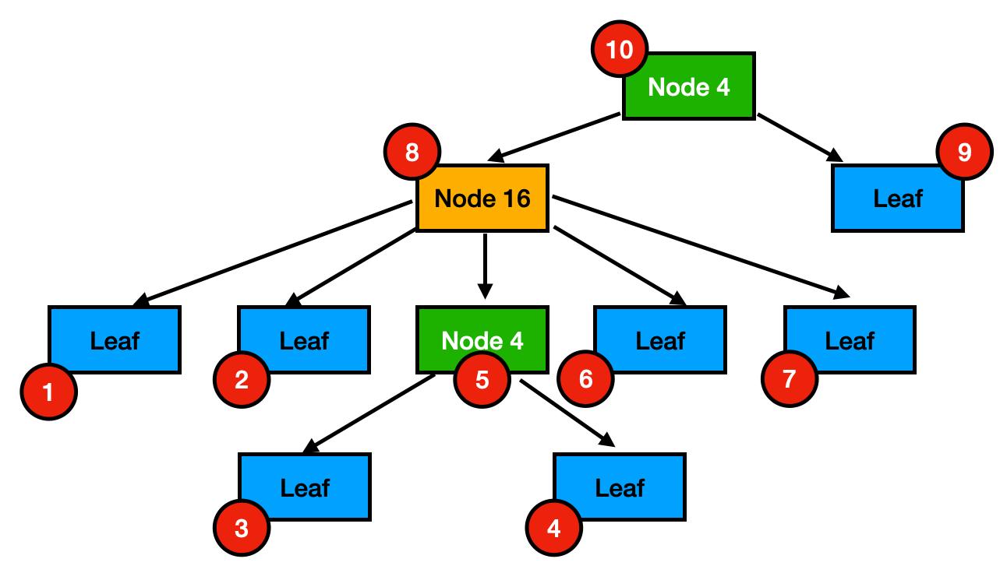

+++
title = "March 2025"
description = "March 2025"
date = 2025-03-03
draft = false
template = "blog/page.html"
+++

# Languages
1. [Rust 2024 年度报告 之一： Rust 2024 Edition 变更特性详解](https://mp.weixin.qq.com/s/sCRHoM-JITyp0L4kgWH1Jw)
   - 哲学
       - Safety & Performance
       - 生态系统 与 社区协作的开放治理
       - Zero Cost Abstractions & 现代语言特性的兼容
       - 系统编程 与 应用落地
   - 2024 Edition (需要花些时间逐一理解一下)
     - if-let chains/ let chains
     - 表达式临时值的scope
     - match 绑定变量
     - ! 类型的回退类型
     - gen 生成器
     - async trait fn
     - async closure
     - use<'a>
2. zig 0.14 2025-3-5 发布 
   - switch 支持 continue :label value 语法
   - .foo 支持 Result Location Semantics
   - field & declarations 不能同名
   - 全局变量初始化可以使用彼此的地址。
   - @branchHint(.unlikely)
   - ...
3. [Const Fn in Rust](https://felixwrt.dev/posts/const-fn/)
   这篇文章并没有介绍 const fn 是如何在 compile time 时evaluate 的，只是介绍了 const fn 的基本用法。
   - [compile time evaluation](https://doc.rust-lang.org/reference/const_eval.html)
4. 学习 register allocation
   - [A Generalized Algorithm for Graph-Coloring Register Allocation](https://c9x.me/compile/bib/pcc-rega.pdf)
   - [CS143 编译原理笔记 6 - Register Allocation](https://zhuanlan.zhihu.com/p/640647465) 中文笔记
     - Liveness Analysis
     - Register interference graph
     - Graph coloring
   - [Linear Scan Register Allocation](https://c9x.me/compile/bib/linearscan.pdf) [中文笔记](https://zhuanlan.zhihu.com/p/628123333)
     简单的选择，life time 最长的variable 进行 spill，简单粗暴（存活时间最长就意味着占用最多资源）
5. 理解 rust 的编译方式与 LTO
   1. rust 的编译单元是 crate, 一个 crate 可以编译称为一个 rlib 或者一个 executable, 一个 crate 会包括多个 .o 文件（具体构成待分析）
   2. rust 在每个 crate 中会对 generic 进行展开，因此，会包括展开的代码（在使用的crate中展开）
   3. 如果 a crate 依赖了 b, c crate，那么在 b, c 中可能都包括了对 generic 的相同展开代码（如果是相同的范型参数）。如果不使用 LTO 
      优化，在最终生成的 a 中会包括重复的代码。启用 LTO 则可以消除。
   4. 这也意味着 generic 展开，会在每个 crate 编译时中重复一次。有分析说这是 rust 慢的主要原因之一，可能是大型项目大量的crate导致了这种情况。
   
   与早期的 C 语言不同，在 C 中，每个 .c 文件编译称为一个 .o 文件，最后通过 linker 进行连接（在早期内存较少的情况下，这种方式是合适的）。

   - Rust/C++ 由于引入了 generic/template, Vec<T> 的代码需要在 T 确定时进行生成。Rust 是在每个 crate 中生成这些代码，然后在 link 时
     通过 LTO 进行合并。
   - Zig 则是作为整体进行编译，因此，总是全局消除重复的。
 
# MPP & OLAP
1. [DuckDB -- ART索引](https://zhuanlan.zhihu.com/p/645064049)
   trie 树的变种，面向内存（索引数据全部加载到内存）
   1. Node4 ( `key[4], child[4]` ):  4 + 4 * 8 = 36 bytes
   2. Node16 ( `key[16], child[16]` ) 16 + 16 * 8 = 144 bytes
   3. Node48 ( `key[256], child[48]` ) 256 + 48 * 8 = 400 bytes
   4. Node256 ( `child[256]` ) 256 * 8 = 2048 bytes
   5. Leaf
   
   优化：Node: prefix + key + index, Leaf: prefix + value。
2. [Duck DB -- ART](https://duckdb.org/2022/07/27/art-storage.html)
   DuckDB 早期 ART 索引是不存储的，启动时会重建。目前的版本是持久化的。
   使用 ART 来存储 PK（每一行都需要在 Leaf 中）:
   1. 是否会占用大量内存？lazy load node 使得无需将全部索引加载到内存中。
   2. 如何进行存储？方便 lazy load
   
   
   使用 post-order 可以使得一个一个 Block (256K) 作为一个整体进行读取（存储时可选压缩）。当 block 未加载时，只需整体加载该 block 到内存中。
   
   
   问题：
   1. post order 维持了 node 的整体有序性，一个 block 中的节点是基本连续、有序的。
   2. 插入、修改操作涉及到对 block 的拆分、合并。
   3. 索引的存储放大比率如何？比如说对 1G 的数据行， ART 索引需要多少空间？

# Web & Visualization

# Tools & Libraries