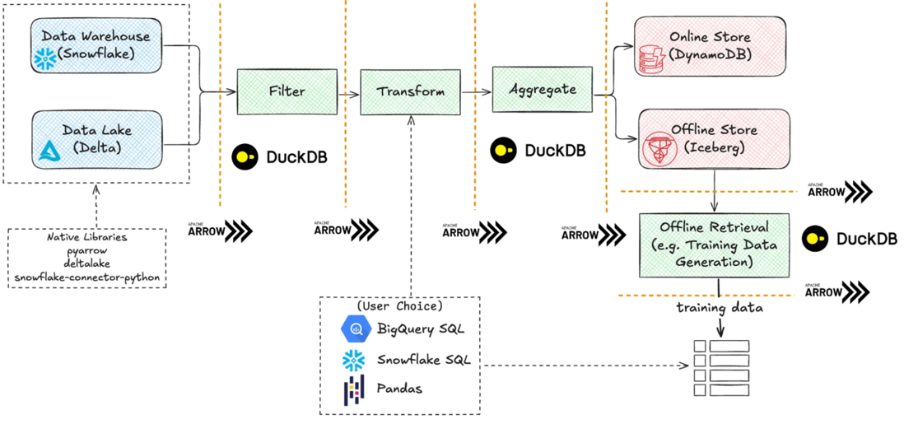

+++
title = "April 2025"
description = "April 2025"
date = 2025-04-02
draft = false
template = "blog/page.html"
+++

# Languages
1. Rust
   1. [does using rust really make safer?](https://tweedegolf.nl/en/blog/152/does-using-rust-really-make-your-software-safer)
      一个很有趣的实验，对一个 DNS 解析的安全漏洞，选择4个人使用Rust进行重写（包括实习生与有经验的同学），整体的安全性能大幅度改进。
   2. [bumpalo:A fast bump allocation arena for Rust.](https://docs.rs/bumpalo/latest/bumpalo/)
      类似于 zig 的 ArenaAllocator。对于 Request/Response 模式的应用场景，有着最好的内存分配性能。
2. Scala
   - Scala.js 1.19.0 对 WASM 支持增强。

# MPP & OLAP
1. Datafusion
   - [Part 1: Query Engine Architecture](https://docs.google.com/presentation/d/1D3GDVas-8y0sA4c8EOgdCvEjVND4s2E7I6zfs67Y4j8/edit#slide=id.p)
   - [Part 2: Logical Plan and  Expressions](https://docs.google.com/presentation/d/1ypylM3-w60kVDW7Q6S99AHzvlBgciTdjsAfqNP85K30)
   - [Part 3: Physical Plan and Execution](https://docs.google.com/presentation/d/1cA2WQJ2qg6tx6y4Wf8FH2WVSm9JQ5UgmBWATHdik0hg)
   思考：
   - 对比 Datafusion 与 DuckDB/Polars 的执行计划
     1. 从 Part 3, page 11 来看，datafusion 在 operator 间基于 async/await 异步执行。而 duckdb 在 pipeline 之内的 operator 是同步执行的。
        这个可能是 duckdb 的性能优势。
   - 引入一个新的 IR 思考：[another query plan IR- draft](@/blog/2025-04-02-qir-design/index.md)
2. [DSM vs. NSM 为什么列存数据库DuckDB的算子会用到行存](https://zhuanlan.zhihu.com/p/1894867212713579084)
3. [duckdb hash aggr性能分析](https://duckdb.org/2024/03/29/external-aggregation.html)
4. [Introducing Rift: Tecton’s Compute Engine](https://www.tecton.ai/blog/introducing-rift-tectons-compute-engine/)
   
   - Big data is dead because of Big Machine. 34T memory * 480 cores
   - Single node queries are cool again.
   - Storage and Compute separation.
   - Familiar, Python-native(notebook), local first developer experience.
   - Scalable, efficient, and portable across all workloads.
   - Faster time to market with lower operational cost.

# Web & Frontend

# Tools & Libraries
