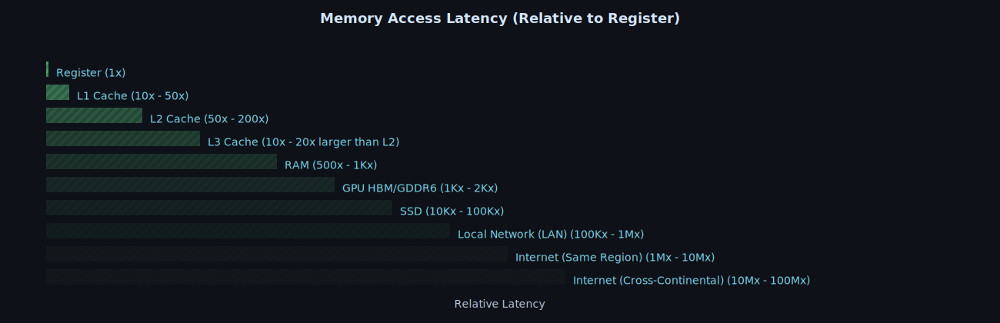

+++
title = "Jun 2025"
description = "Jun 2025"
date = 2025-06-02
draft = false
template = "blog/page.html"
+++

# Languages
1. Rust
   - Async from scratch 系列教程
     - [1: What is in a Future, anyway?](https://natkr.com/2025-04-10-async-from-scratch-1/)
     - [2: Wake me maybe](https://natkr.com/2025-04-15-async-from-scratch-2/)
     - [3: Pinned against the wall ](https://natkr.com/2025-05-22-async-from-scratch-3/)
   - [Roto](https://github.com/NLnetLabs/roto) An Embedded script language that is fast, safe and easy to use.
     这个脚本语言在某种程度上很符合我的个人偏好，不过，内在的不支持 loop 的设计是否会限制语言的应用场景？作为一个 safe 的脚本语言，其边界必须是
     精心控制的，强类型适合于 compiled（基于[cranelift](https://cranelift.dev)项目），这有利于鲁棒性和性能。
   - SIMD in zlib-rs
     - [Autovectorization and target features](https://tweedegolf.nl/en/blog/153/simd-in-zlib-rs-part-1-autovectorization-and-target-features)
     - [compare256](https://tweedegolf.nl/en/blog/155/simd-in-zlib-rs-part-2-compare256)
   - [Rust memory latency and performance](https://developerlife.com/2025/05/19/rust-mem-latency/)
     - [New CPUs don't speed up old code](https://www.youtube.com/watch?v=m7PVZixO35c&feature=youtu.be)
     - [Data oriented design](https://youtu.be/WwkuAqObplU): Flat dara structure are better for memory locality
     - [Memory Latency vs CPU operation](https://youtu.be/Dhn-JgZaBWo)
     - [Memory Allocation Tips](https://youtu.be/pJ-FRRB5E84&t=1831)
       - [smallvec](https://docs.rs/smallvec/latest/smallvec/struct.SmallVec.html) 类似于 Arrow 的 [Variable-size Binary View Layout](https://arrow.apache.org/docs/format/Columnar.html#variable-size-binary-view-layout)
       - [smallstr](https://docs.rs/smallstr/0.3.0/smallstr/)
     - 
     - Stack vs heap 以及广义的类 String/Vec 数据结构中的一级存储、二级存储。
     - rust drop 开销比 alloc 要大: 是否是因为 drop 自身的开销而非 dealloc？
     - memory alignment 对性能的影响
     - Global Allocators
       - jemalloc: 多线程、大量小对象(chunk设计)
       - default/ptmalloc:  单线程
       - tcmalloc: 三级 ThreadCache + CentralCache + PageHeap， 自旋锁, 小对象无锁分配，瞬态高并发
     - RingBuffer：使用数组模拟链表，更好的内存局部性
   

# MPP & OLAP

# Web & Frontend

# Tools & Libraries

