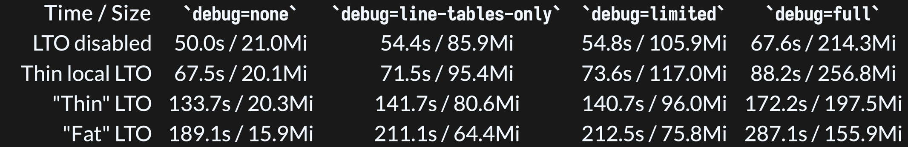
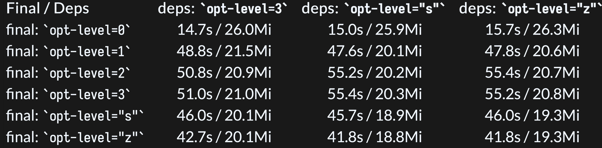

+++
title = "Jul 2025"
description = "Jul 2025"
date = 2025-07-07
draft = false
template = "blog/page.html"
+++

# Languages
1. rust
   - [https://sharnoff.io/blog/why-rust-compiler-slow](Why is the Rust compiler so slow?)
     - 
     - 
     - debug , LTO, optimization
     - `RUSTFLAGS="-Cllvm-args=-inline-threshold=50 -Cllvm-args=-inlinedefault-threshold=50 -Cllvm-args=-inlinehint-threshold=50"`
     - Reducing inlining with LLVM args;
     - Breaking up expensive functions in the main crate; and
     - Removing generics from dependencies to prevent needing to compile it in the main crate
     Timeline:
     -  We started at ~175s
     -  Disabling LTO (and debug symbols!) got us to 51s (-71%)
     -  Changing to opt-level = 1 on the final crate got us to 48.8s (-4%)
     -  Reducing inlining with -C llvm-args got us to 40.7s (-16%)
     -  Local changes got us to 37.7s (-7%)
     -  Changes with dependencies got us to 32.3s (-14%)
     -  Enabling -Zshare-generics got us to 29.1s (-10%)
     -  And switching away from alpine got us to 9.1s (-69%)
   - [Leaktracer: A Rust allocator to trace memory allocations](https://blog.veeso.dev/blog/en/leaktracer-a-rust-allocator-to-trace-memory-allocations/)
2. zig
   - [zig's new async io](https://kristoff.it/blog/zig-new-async-io/)
   - [What is Zig's “Colorblind” Async/Await?](https://kristoff.it/blog/zig-colorblind-async-await/)

# MPP & OLAP

# Web & Frontend
1. [Dashboard That Works: A Step-by-Step Guide for Startups in 2025](https://uxplanet.org/dashboard-that-works-a-step-by-step-guide-for-startups-in-2025-1cec1bfe7f9c)
   
   A truly functional dashboard: 
   - GOALS, DATA, PEOPLE, LOGIC
   - analysts, designers, developers
   - work for business, not just look pretty
   - Don't try to make a dashboard for everyone
   - define use cases and users
   - identify key metrics
   - prepare data
   - sketch a rough layout
   - get user feedback
   - write a solid brief for designers
   - find the right builders
   - Launch, watch, improve
2. [fastplotlib](a plotting library built on WGPU)
   - based on [pygfx](a python-graphics library visualization framework on WGPU)
   思考：结合 Vega, Pixi, D3 等框架，思考一种描述 visualization 的最佳方式。
   - Vega：使用 JSON 的方式，缺乏类型化约束，不便于理解、使用，部份的能力过于糖化。
   - 使用多维空间的方式来理解 visualization
   - 将数据（关系数据、多维数据）映射到（可视化）多维空间。
   - 使用 react 的方式来理解 interact
   - 更好的表示语言？
     - JSON based
     - more datatype: date, interval, float, decimal, more via regexp"..." style
     - JSON constructor:   Color { r g b }
     - functional constructor: Color(r, g, b), with fixed parameter and named parameter
     - enum literal. .RED instead of Color.RED
     - reference spec: global reference, document reference, scoped reference.
3. [AntV G2](https://g2.antv.antgroup.com/manual/quick-start)
   粗览一下文档和示例，G2 的概念与 vega 时非常相似的，提供2种 API: 命令式 和 DSL 式。

# LLM & Agents
1. [LLM Powered Autonomous Agents](https://lilianweng.github.io/posts/2023-06-23-agent/)
   
2. AutoGPT
3. AnyTool
4. HuggingGPT
5. Understanding the planning of LLM agents: A survey
6. https://github.com/AntonOsika/gpt-engineer