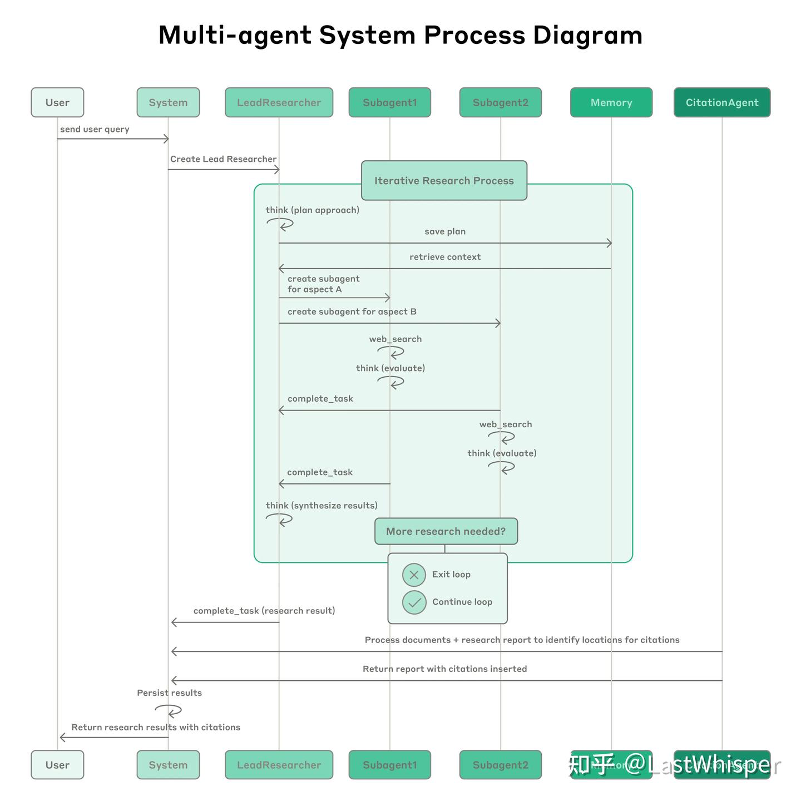

+++
title = "Aug 2025"
description = "Aug 2025"
date = 2025-08-07
draft = false
template = "blog/page.html"
+++

# Languages
1. [Another Easy, Fast, Safe Langauge](https://vale.dev)
   又一门野心勃勃的编程语言，能够同时在 easy, safe, fast 上获得平衡。其中的 generational reference 概念确实很有创意
   - [Vale's Memory Safety Strategy: Generational References and Regions](https://verdagon.dev/blog/generational-references)

# Mpp & OLAP

# Web & Frontend
1. [Web Browser Engineering](https://browser.engineering/index.html) 介绍 Browser 原理的好资料。

# AI & Agent
1. [How we built our multi-agent research system](https://www.anthropic.com/engineering/multi-agent-research-system)
2. [Multi-Agent System，一篇就够了](https://zhuanlan.zhihu.com/p/1928636720796136414) 
3. 模式
   - Plan - Executor(think-act-observe) 
   - PDCA
   - 主智能体：调度、全局思维、探索不同路径、聚焦整体目标
   - 子智能体：拥有自己独立的上下文窗口、工具集和相对具体的任务目标。
4. TestCase
   - 封闭目标
   - 开放目标：使用 LLM 作为裁决者
5. 搜索即压缩、压缩即智能
   - 子智能体：消化大量原始知识，提炼出压缩后的洞见，交给主智能体进行提炼。
   
# Misc