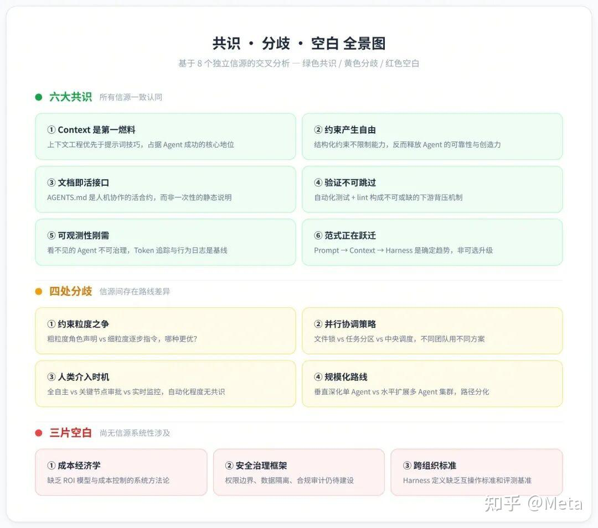

+++
title = "Mar 2026"
description = "2026-03 monthly"
date = 2026-03-01
draft = false
template = "blog/page.html"
+++

# Languages
## Rust
 
## Scala

# Mpp & OLAP
     
# Web & Frontend
- [Building a Pure-Rust Charting Library](https://autognosi.medium.com/scalable-crates-with-lod-in-wasm-interactive-svg-charts-in-pure-rust-for-dashboards-f6f5103dba38)
  - [lodviz-rs](https://github.com/automataIA/lodviz-rs)
  - 基于 Leptos 的 react, 纯 rust, 通过 wasm 编译成 web 前端，提供交互式的 svg 图表库，适合 dashboard 场景。
  - lodviz_core: 无UI依赖的核心库，提供数据处理、LOD计算等功能。
  - lodviz_components
  - 11种图表类型，支持交互式功能如缩放、工具提示、图例等。
  - LOD: 通过采样技术，对大型的数据集进行采样，减少渲染开销。通过在 rust 中实现这些算法，相比 JS 提高性能。
    - LTTB: Largest Triangle Three Buckets，适合大规模数据的线图降采样算法。
    - M4: 可视化层面的再聚合（first/last/min/max)
    - Gaussian KDE: 基于高斯核密度估计的降采样算法，适合散点图等。
  - 图形语法：类似于 vega-lite。
  
  我年前也实现了一个 viz 引擎，对 d3, vega, vega-lite 等图形语法相对深入的进行学习和对比，最好还是自己设计了 viz-spec 语法（也是借鉴 vega-lite）。看这篇文章后，感受更深刻一些。

# AI & Agent
  - [Harness Engineering](https://zhuanlan.zhihu.com/p/2014014859164026634) 好文：Agent 时代的新思考
    - 模型能力已经不是瓶颈
    - Agent 目前的典型失败模式：试图一步到位、过早宣布胜利、过早标记功能完成、环境启动困难（本质还是对目标的定义能力困难）
    - Harness 四大支柱
      - 上下文架构：不多不少，分层递进。
      - Agent 专业化
      - 持久化记忆。
      - 结构化执行：将思考和执行分离，理解-规划-执行-验证
    - 实战案例： OpenAI: 
        - 设计环境，而非编写代码，当Agent卡住时，不是更加努力，而是诊断缺少什么能力，并让Agent 构建该能力
        - 机械化的执行架构约束。
        - 将代码仓库作为 SPOT
        - 将可观测性链接到 agent
        - 对抗熵，花时间清理“低质量生成物”
        - Linter 改进：给出Agent修复的有效建议
      - 实战案例：Anthropic 
        - 精心设计的 console 和 日志输出，对 AI  友好
        - Agent 时间盲区
        - CI 作为 harness 
      - 工程师角色的改变
        - 从写代码到设计环境
        - 规划是新的编码
        - 两种并行模式：有人值守、无人值守
    

# Misc
